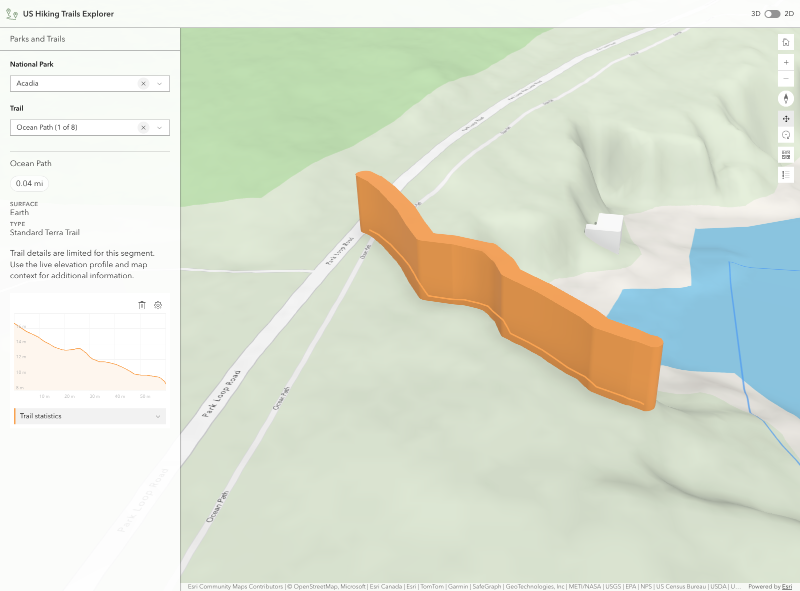
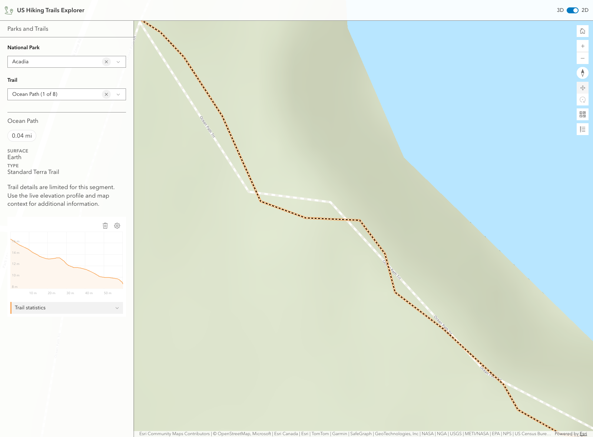

# US Hiking Trails Explorer

This application explores hiking trails across U.S. National Parks using the ArcGIS Maps SDK for JavaScript and a configured ArcGIS WebMap. The experience opens in 3D, offers an optional 2D switch, and keeps the sidebar focused on park and trail selection, trail details, and the live elevation profile for the active route.

This project builds on [Esri's hiking-trails-app](https://github.com/Esri/hiking-trails-app) by [Raluca Nicola](https://github.com/RalucaNicola), but the current product framing, data assumptions, and deployment flow are now specific to a U.S. National Parks experience.

## Screenshots

The current screenshots show Acadia National Park with the Ocean Path trail selected in both supported view modes.

| 3D selected trail | 2D selected trail |
| --- | --- |
|  |  |

## Features

* Browse U.S. National Parks and their hiking trails from two searchable Calcite comboboxes. Trail options stay scoped to the selected park, and the detail panel shows available trail facts plus a live elevation profile.

* Start in a 3D `SceneView` and switch to a 2D `MapView` while preserving the current park and trail context when practical. Basemap switching stays on official ArcGIS map components through `arcgis-expand` and `arcgis-basemap-gallery`, with curated 3D and 2D basemap sources per view mode.

* Infer park and trail layers from the loaded web map at runtime instead of hard-coding service URLs or field names. The app prefers join fields such as `UNIT_CODE`, `UNITCODE`, `UNIT_ID`, and `PARK_ID`, and falls back to spatial association when those joins are missing.

* Filter the park list to actual National Parks when designation metadata such as `UNIT_TYPE` is available, and keep map selection focused by filtering to the selected park and trail while preserving highlight graphics.

## Recent updates

* Park selection rendering now suppresses the selected source polygon symbology and relies on a dedicated highlight graphics layer, so selected parks remain outline-only even when zoomed in.

* In 3D, the selected trail now uses a volumetric wall-like highlight built from a SceneView `line-3d` path symbol, while 2D continues to use the lighter simple-line highlight fallback.

* The elevation profile flow now validates selected trail geometry before widget creation. The selected trail is converted into an ArcGIS `Graphic`, and incomplete or invalid polyline inputs show a concise in-panel fallback instead of failing silently.

* Trail and park initialization now retries briefly while the web map and inferred layers finish loading. The sidebar loader and empty-state messaging stay in sync with that initialization path.

* Active park and trail selections are reapplied after 3D/2D view switches, and the elevation profile is rebuilt against the current view so the panel remains consistent across mode changes.

* In 3D park-only selection, the inferred trails layer now stays draped on the ground and keeps the original National Park Service trail symbology on the source layer while the dedicated overlay improves discoverability.

* Vite now serves Calcite and ArcGIS component runtime assets directly from installed packages during development and copies them into `dist` during production builds and CI, so the app remains deployable as a static GitHub Pages site without committing generated runtime trees.

* The trail detail area below the comboboxes now separates compact fact badges from stacked attribute rows such as surface, use, type, and class to improve readability.

* Active park selection now suppresses overlapping polygon layers from the source WebMap so the selected park interior stays clear in 3D while the blue outline remains the only visible park treatment.

* Trail fact badges now prefer richer trip stats, including source length fields when available and a selected-trail geodetic distance fallback when they are not.

* Home navigation is now view-mode-aware, so the initial mount and the Home control return to a continental U.S. map extent in 2D and a dedicated continental U.S. camera in 3D.

## Maps and layers used

The default map configuration in [src/ts/config.ts](./src/ts/config.ts) points to ArcGIS WebMap item `5a94b21ff6e94d10ae61483c392bbf9b`.

The app loads that web map once and uses it for both 3D and 2D views:

* `SceneView` is the default experience.
* `MapView` is available from the header toggle for a 2D route and map view.
* The Home button uses a U.S.-wide starting viewpoint so the app opens with national context.

Park and trail layers are resolved dynamically from the web map at runtime:

* Park layers are inferred from polygon feature layers with park, boundary, reserve, or national signals in their titles, URLs, display fields, or field names.
* Trail layers are inferred from polyline feature layers with trail, route, or hike signals.
* Trail and park IDs and names are derived heuristically from available fields rather than fixed schema assumptions.
* When a park layer exposes designation metadata such as `UNIT_TYPE`, the UI narrows the park list to National Parks only.
* When a trail-to-park join field is unavailable, the app falls back to spatial intersection so trails can still be associated with parks.

Because the app intentionally infers layers from the configured web map, you can repoint it to a different compatible map without rewriting fixed layer URLs throughout the UI.

## Current implementation notes

* The app keeps selected-only visibility by filtering the source park and trail layers to the active object IDs while rendering the visible highlight styling from a separate graphics layer.

* Park suppression now restores original layer visibility and definition expressions when selection is cleared, while temporarily hiding other polygon layers that would otherwise overlap the selected park.

* Park highlighting is intentionally outline-first. When a trail is also selected, the park outline becomes faint so the trail highlight remains visually dominant.

* In SceneView, the selected trail highlight uses a volumetric `line-3d` path symbol with a quad profile to create a wall-like 3D trail emphasis. In MapView, the selected trail falls back to a simpler flat line highlight.

* Trail detail fallbacks prefer concise values from inferred attributes such as surface, use, type, and seasonal description, while the `arcgis-elevation-profile` component backed by ArcGIS ElevationProfile behavior remains the source of elevation information. When trail-length fields are missing or ambiguous, the selected trail can fall back to a geodetic distance measurement for the fact badges.

* Basemap controls remain component-driven. The collapsed basemap trigger stays aligned with the other top-right map controls, and the expanded gallery uses view-mode-specific sources rather than a single default gallery list.

* Layer inference is biased toward the current NPS boundary layer because it exposes `UNIT_CODE` and `UNIT_TYPE`, which are needed for National Park filtering and park-to-trail association, but the app still falls back to another compatible polygon parks layer when needed.

* Top-right controls stay on official ArcGIS map components, including `arcgis-home`, `arcgis-zoom`, `arcgis-compass`, `arcgis-navigation-toggle`, `arcgis-basemap-gallery`, and `arcgis-legend` hosted inside `arcgis-expand` controls.

## Instructions

1. Fork and then clone the repo.
2. Install dependencies with `npm install`.
3. Review the [config](./src/ts/config.ts) file if you want to point the app at a different ArcGIS WebMap item or adjust selection colors.
4. Start the development app with `npm run start`.
5. Validate types with `npm run type-check`.
6. Create a production build with `npm run build`.
7. Preview the production build locally with `npm run preview`.

## GitHub Pages deployment

The app is deployed as a static site. During local development, Vite serves Calcite, ArcGIS map-components, and ArcGIS common-components runtime assets directly from the installed packages. During production builds and CI, Vite copies those runtime assets into the generated `dist` output so they can be published as static files.

Static head assets referenced from `index.html` must also resolve in the built site. App icons and Microsoft tile metadata should point to Vite-emitted assets or files in `public/`, not to `src/...` paths that disappear from the published `dist` output.

The recommended deployment path is GitHub Pages through GitHub Actions:

1. `npm ci`
2. `npm run type-check`
3. `npm run build`
4. Publish the generated `dist` output

The included Pages workflow uses that flow so generated component assets do not need to be maintained manually in source control.

## Credentials

ArcGIS credentials are not committed in this repository. [src/ts/main.ts](./src/ts/main.ts) only sets `esriConfig.apiKey` when a value is explicitly provided through configuration. Any future key should be injected through an environment-backed path or local configuration process rather than checked into source control.

## Requirements

* Node.js and npm
* A modern web browser with access to the Internet and ArcGIS web resources

## Resources

The following libraries, APIs, and data sources are used by this application:

* [ArcGIS Maps SDK for JavaScript](https://developers.arcgis.com/javascript/) package runtime via the 5.x `@arcgis/core`, `@arcgis/map-components`, and `@arcgis/common-components` dependencies specified in `package.json`.
* [Calcite Components](https://developers.arcgis.com/calcite-design-system/) for the searchable park and trail comboboxes and header controls.
* ArcGIS WebMap item `5a94b21ff6e94d10ae61483c392bbf9b` as the default map source.
* Park and trail feature layers supplied by that web map and inferred at runtime from layer geometry, titles, URLs, display fields, and field names.
* ArcGIS `arcgis-elevation-profile` component for the selected trail's live elevation profile.

## Validation status

The current implementation has been validated with:

* `npm run type-check`
* `npm run build`

The current production build may still emit Vite chunk-size warnings because ArcGIS packages contribute several large bundles. Those warnings are a performance follow-up area, not a failed build.

## Disclaimer

This demo application is for illustrative purposes only and it is not maintained. There is no support available for deployment or development of the application.

## Contributing

Esri welcomes contributions from anyone and everyone. Please see our [guidelines for contributing](https://github.com/esri/contributing).

## Licensing
Copyright 2019 Esri

Licensed under the Apache License, Version 2.0 (the "License");
you may not use this file except in compliance with the License.
You may obtain a copy of the License at

   http://www.apache.org/licenses/LICENSE-2.0

Unless required by applicable law or agreed to in writing, software
distributed under the License is distributed on an "AS IS" BASIS,
WITHOUT WARRANTIES OR CONDITIONS OF ANY KIND, either express or implied.
See the License for the specific language governing permissions and
limitations under the License.

A copy of the license is available in the repository's [license.txt](./license.txt ) file.
